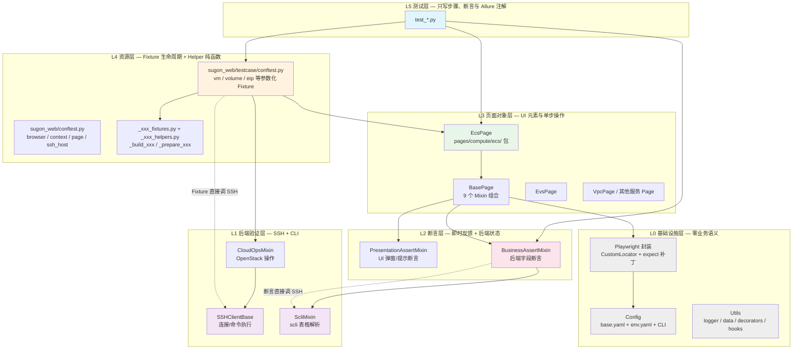
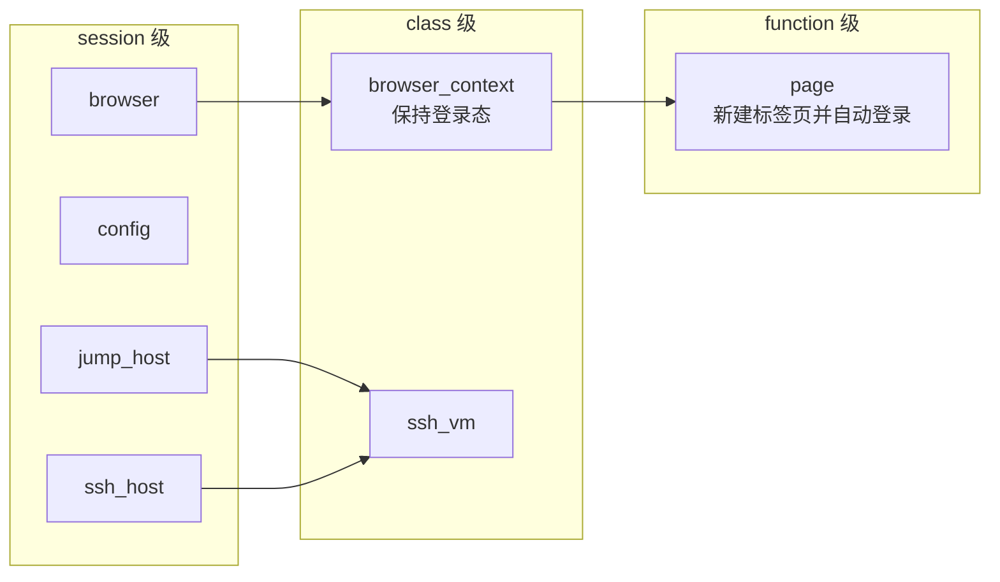
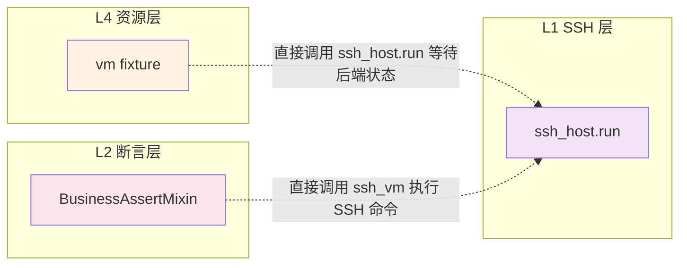

## 1. 当前整体架构图（6 层依赖关系）

### 1.1 架构说明

下图展示框架的**静态代码依赖结构**，共 6 个层级（L5 → L0）。箭头表示「上层组件对下层组件的依赖或调用关系」。

核心约束：
- **上层可以调用下层，下层不可反向依赖上层**。
- 跨层穿透（如 Fixture 直接调 SSH、断言层直接调 SSH）属于架构异味，在图中用红色虚线标出。

### 1.2 各层职责对照

| 层级 | 代表文件/类 | 核心职责 |
|------|------------|---------|
| L5 测试层 | `test_*.py` | 只写测试步骤、断言与 Allure 注解 |
| L4 资源层 | `conftest.py`、`_xxx_fixtures.py`、`_xxx_helpers.py` | 管理资源生命周期、环境组装 |
| L3 页面对象层 | `BasePage` + `EcsPage`/`EvsPage`/... | 封装页面元素定位器和单步业务操作 |
| L2 断言层 | `PopupAssertionMixin`、`EcsAssertionMixin` | 验证 UI 即时反馈与后端实际状态 |
| L1 后端验证层 | `SSHClientBase`、`ScliMixin`、`CloudOpsMixin` | SSH 连接与后端 CLI 操作 |
| L0 基础设施层 | `Playwright` 封装、`Config`、`Utils` | 零业务语义的基础能力 |

---

## 2. Fixture 作用域关系

---

## 3. 当前架构的关键跨层穿透点

> 这些跨层穿透是后续架构优化的重点目标：应通过新增 L1.5 查询服务层进行隔离，使 Fixture 与断言层不再直接依赖 SSH 连接细节。
