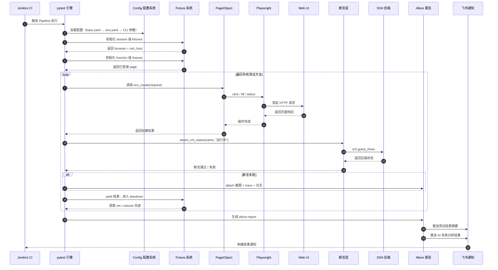

## 1. 测试执行流程图（端到端数据流）

### 1.1 流程说明

下图展示一次完整测试执行的**端到端数据流**：从 Jenkins Pipeline 触发，到 Allure 报告生成，最终飞书推送通知，形成闭环。

### 1.2 关键阶段说明

| 阶段 | 说明 | 对应组件 |
|------|------|---------|
| 1. 触发执行 | Jenkins Pipeline 调用 pytest 命令 | Jenkins → pytest |
| 2. 配置加载 | 三层配置合并：base.yaml → env.yaml → CLI 参数 | `Config` |
| 3. Session 初始化 | 创建 browser、ssh_host 等会话级资源 | `sugon_web/conftest.py` |
| 4. Function 初始化 | 每个测试方法新建 page 并自动登录 | `_create_logged_in_page` |
| 5. UI 操作 | PageObject 调用 Playwright 与 Web UI 交互 | `EcsPage` → Playwright → Web UI |
| 6. 后端断言 | 断言层通过 SSH 执行 scli 命令验证实际状态 | `EcsAssertionMixin` → `SSHClientBase` |
| 7. 失败现场 | 断言失败时自动截图、附加 trace 到 Allure | `pytest_runtest_makereport` |
| 8. 资源清理 | yield 结束后按依赖顺序清理资源 | `vm` fixture teardown |
| 9. 报告生成 | Allure 汇总测试结果与环境信息 | Allure |
| 10. 通知推送 | 飞书机器人推送结果摘要 + AI 失败分析 | 飞书通知 |
