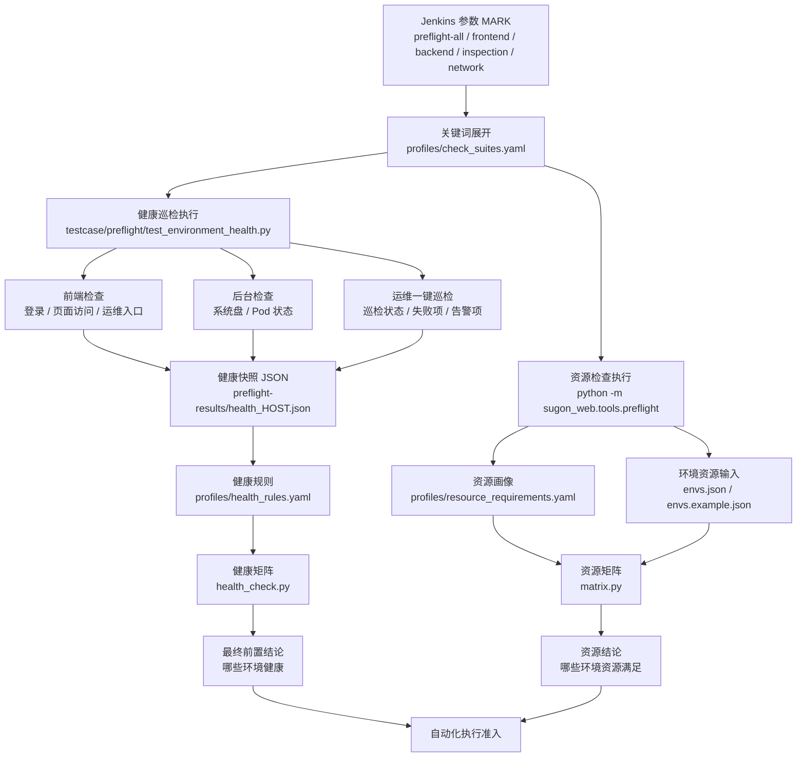
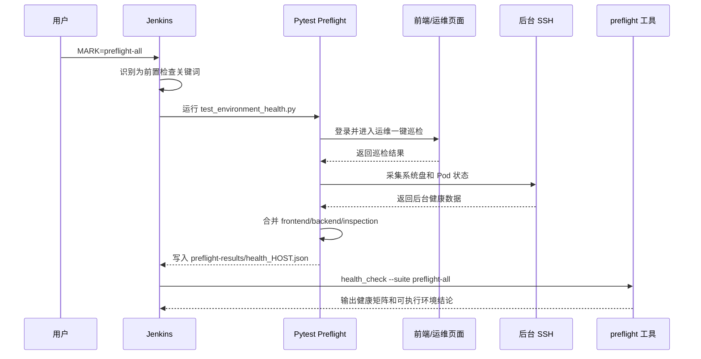
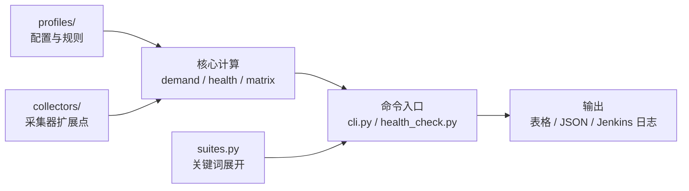

# 自动化前置环境检查架构图

如需汇报展示版，可直接打开 `PREFLIGHT_ARCHITECTURE_VISUAL.html`，样式参考流程海报图设计。

## 整体架构

## Jenkins 执行链路

## 目录职责

## 推荐关键词

| Jenkins MARK | 含义 | 展开内容 |
| --- | --- | --- |
| `preflight-all` | 完整健康前置检查 | 前端 + 后台 + 运维一键巡检 |
| `frontend` | 前端健康检查 | 登录、页面访问、运维入口 |
| `backend` | 后台健康检查 | 系统盘、Pod 状态 |
| `inspection` | 运维巡检检查 | 一键巡检状态、失败项、告警项 |
| `network` | 网络模块资源检查 | 网络相关资源需求 |
| `storage` | 存储模块资源检查 | 存储相关资源需求 |
| `compute` | 计算模块资源检查 | 计算相关资源需求 |
